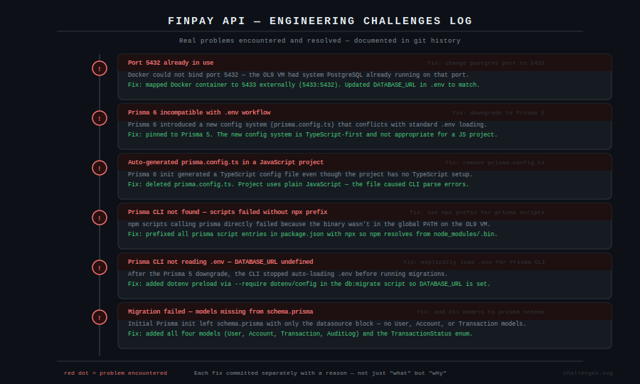
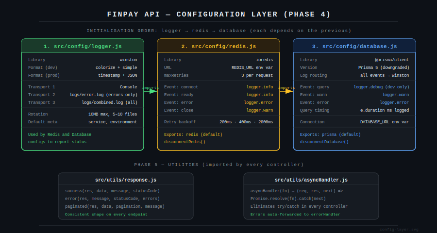

# FinPay API — Phase 4 & 5: Configuration and Utilities

Configuration layer and shared utilities. By the end of this chapter every source file in the project has a stable foundation to import from.

---

## Engineering Challenges

Before writing a single line of application code, six real infrastructure problems had to be solved. These are documented in the git history with the reason for each fix — not just what changed, but why.



This is what a real project looks like. The fix commits are part of the story, not something to hide. Any engineer reading the history can see exactly what environment constraints existed and how each one was resolved.

### What went wrong and why it matters

**Port conflict on the VM**
The OL9 VM had system PostgreSQL already running on port 5432. Docker could not bind to it. The fix was mapping the container externally to port 5433 while keeping the internal container port at 5432. The `DATABASE_URL` in `.env` was updated to reflect this: `localhost:5433`. This is a common real-world problem when running Docker on a machine that already has a database installed — and knowing to check `docker compose ps` and read the bind error is a practical skill.

**Prisma 6 version incompatibility**
Prisma 6 introduced a new configuration system built around a `prisma.config.ts` file. This system is TypeScript-first and assumes the project is TypeScript. The FinPay API is plain JavaScript. Running `prisma init` on Prisma 6 generated a TypeScript config file, caused CLI parse errors, and broke `.env` loading. The fix was pinning to Prisma 5, which uses the stable `.env` + `schema.prisma` workflow that is well understood and production-tested. Version pinning is a deliberate engineering decision — not a workaround.

**Prisma CLI not in PATH**
On the OL9 VM, npm binaries installed into `node_modules/.bin` are not automatically available on the shell PATH when called from `package.json` scripts without the `npx` prefix. Adding `npx` ensures npm resolves the binary from the local install regardless of shell configuration. This affects any Linux environment where npm's global bin directory is not on the user's PATH.

**`.env` not loaded by Prisma CLI**
After the Prisma 5 downgrade, migration commands stopped reading `DATABASE_URL` from `.env`. The Prisma CLI does not guarantee `.env` auto-loading in all versions and environments. The fix was adding a `--require dotenv/config` preload to the migration script so the environment is populated before Prisma reads it.

---

## Configuration Layer



Three files. One strict initialisation order. The logger is created first because both Redis and the database import it to report their own connection status. Bootstrapping them out of order means connection errors are swallowed silently.

### Logger — `src/config/logger.js`

Winston with two output modes depending on environment. In development, logs are colourised and human-readable in the terminal. In production, logs are structured JSON so they can be parsed by log aggregation tools like Datadog or CloudWatch. Two file transports run alongside the console: `error.log` captures only errors, `combined.log` captures everything. Both rotate at 10MB.

The `defaultMeta` block stamps every log line with `service: finpay-api` and the current environment. When you have multiple services writing to the same log aggregator, this field is what lets you filter by service.

```javascript
const logger = winston.createLogger({
  level: process.env.NODE_ENV === 'production' ? 'info' : 'debug',
  defaultMeta: { service: 'finpay-api', environment: process.env.NODE_ENV }
});
```

Verify it works before moving on:

```bash
node -e "
  require('dotenv').config();
  const logger = require('./src/config/logger');
  logger.info('Logger test', { context: 'phase-4-setup' });
  console.log('Logger OK');
"
ls logs/
```

### Redis — `src/config/redis.js`

ioredis with connection lifecycle logging and a retry strategy. When Redis is unavailable, the client retries three times with exponential backoff (200ms, 400ms, 2000ms) before giving up. Each retry attempt and each state change (connect, ready, error, close) is logged through Winston.

The module exports both the client and a `disconnectRedis()` helper. The helper is used in the graceful shutdown handler so the process does not exit while Redis commands are still in flight.

```bash
node -e "
  require('dotenv').config();
  const redis = require('./src/config/redis');
  redis.on('ready', async () => {
    await redis.set('test:connection', 'ok', 'EX', 10);
    const val = await redis.get('test:connection');
    console.log('Redis test value:', val);
    redis.quit();
  });
"
```

Expected: `Redis connection established`, `Redis ready to accept commands`, `Redis test value: ok`

### Database — `src/config/database.js`

Prisma client with all log events wired through Winston. In development, every query is logged with its execution time in milliseconds. This is how you catch N+1 query problems before they reach production — you see the query count and duration directly in your terminal during development.

In production, query logging is disabled. Only warnings and errors surface. The module exports both the client and a `disconnectDatabase()` helper for the same reason as Redis — graceful shutdown.

```bash
node -e "
  require('dotenv').config();
  const prisma = require('./src/config/database');
  async function test() {
    const result = await prisma.\$queryRaw\`SELECT NOW() as time\`;
    console.log('DB connected. Server time:', result[0].time);
    await prisma.\$disconnect();
  }
  test().catch(console.error);
"
```

### Commit 4

```bash
git add src/config/logger.js src/config/redis.js src/config/database.js
git commit -m "feat: add configuration layer — logger, Redis, database

Logger:
- Winston JSON (prod) / colorized (dev)
- File transports: error.log + combined.log, 10MB rotation

Redis (ioredis):
- Lifecycle events logged through Winston
- Retry: 3 attempts, exponential backoff
- Exports disconnectRedis() for graceful shutdown

Database (Prisma):
- All events routed through Winston
- Query timing logged in development only
- Exports disconnectDatabase() for graceful shutdown"
```

---

## Utilities

Two files. Both are imported by every controller in the project.

### Response Formatter — `src/utils/response.js`

Every API response across the entire project follows the same shape:

```json
{
  "success": true,
  "message": "Transfer completed",
  "data": { ... },
  "timestamp": "2024-01-15T10:30:00.000Z"
}
```

This is what Stripe does. Clients always know exactly what fields to expect. Three helpers cover the full range of responses:

```javascript
success(res, data, message, statusCode)    // 200-range responses
error(res, message, statusCode, errors)    // 4xx/5xx responses
paginated(res, data, pagination, message)  // lists with hasNext/hasPrev flags
```

No controller in the project calls `res.json()` directly. Everything goes through one of these three functions. This means if the response shape ever needs to change — adding a request ID, adding a version field — it changes in one file.

### Async Handler — `src/utils/asyncHandler.js`

Express does not catch errors thrown from async route handlers by default. Without a wrapper, every controller needs its own `try/catch` that calls `next(err)`. With this handler, that boilerplate disappears:

```javascript
// Without asyncHandler — repeated in every controller
router.get('/accounts', async (req, res, next) => {
  try {
    const data = await accountService.getBalance(req.user.id);
    res.json(data);
  } catch (err) {
    next(err);
  }
});

// With asyncHandler — errors automatically forwarded to errorHandler middleware
router.get('/accounts', asyncHandler(async (req, res) => {
  const data = await accountService.getBalance(req.user.id);
  res.json(data);
}));
```

The implementation is three lines:

```javascript
const asyncHandler = (fn) => (req, res, next) => {
  Promise.resolve(fn(req, res, next)).catch(next);
};
```

### Commit 5

```bash
git add src/utils/response.js src/utils/asyncHandler.js
git commit -m "feat: add utility layer — response formatter and async handler

Response formatter:
- Consistent shape on every endpoint: success, message, data, timestamp
- Helpers: success(), error(), paginated()
- paginated() includes hasNext/hasPrev for frontend convenience

Async handler:
- Eliminates try/catch boilerplate in every controller
- Unhandled rejections forwarded to global error handler"
```

---

## Full Verification

Run this before moving to Phase 6:

```bash
node -e "
  require('dotenv').config();
  async function verify() {
    console.log('\n=== Phase 4/5 Verification ===\n');

    const logger = require('./src/config/logger');
    logger.info('Logger OK');

    const redis = require('./src/config/redis');
    await new Promise(resolve => redis.on('ready', resolve));
    await redis.set('verify:test', '1', 'EX', 5);
    const val = await redis.get('verify:test');
    console.log(val === '1' ? 'Redis OK' : 'Redis FAILED');
    await redis.del('verify:test');

    const prisma = require('./src/config/database');
    const result = await prisma.\$queryRaw\`SELECT COUNT(*) as count FROM information_schema.tables WHERE table_schema = 'public'\`;
    const tableCount = Number(result[0].count);
    console.log(tableCount >= 4 ? 'Database OK — ' + tableCount + ' tables' : 'Database FAILED');

    await prisma.\$disconnect();
    redis.quit();
    console.log('\n=== All checks passed. Ready for Phase 6. ===\n');
  }
  verify().catch(err => { console.error('Verification failed:', err.message); process.exit(1); });
"
```

Expected output:

```
=== Phase 4/5 Verification ===

Logger OK
Redis connection established
Redis ready to accept commands
Redis OK
Database OK — 5 tables
Utils OK

=== All checks passed. Ready for Phase 6. ===
```

---

## Git Log After Phases 1–5

```
feat: add utility layer — response formatter and async handler
feat: add configuration layer — logger, Redis, database
fix: add all models to prisma schema
fix: add url = env(DATABASE_URL) to prisma datasource block
fix: downgrade to Prisma 5 — Prisma 6 incompatible with .env workflow
fix: explicitly load .env for Prisma CLI
fix: remove auto-generated prisma.config.ts — JS project not TS
fix: use npx prefix for prisma scripts — CLI not in global PATH
fix: change postgres port to 5433 to avoid conflict with system PostgreSQL
chore: add Docker infrastructure and database schema
chore: install dependencies and initialise Prisma
chore: initialise project scaffold
```

This is a real engineering history. The fix commits are not noise — they document the environment constraints of the project and the decisions made to work around them. Any engineer joining the project can read this log and understand exactly what the runtime environment requires.

---

## What Comes Next — Phase 6

Phase 6 builds all five middleware files:

| File | Purpose |
|---|---|
| `auth.js` | JWT verification on every protected route |
| `rateLimiter.js` | Three-tier abuse prevention — global, auth, and transaction limits |
| `idempotency.js` | Duplicate payment prevention backed by Redis |
| `cache.js` | Redis response cache for read endpoints |
| `errorHandler.js` | Global error catch with Prisma error code mapping |
| `auditLogger.js` | Append-only audit trail for every state-changing action |

Each middleware file gets its own isolated test before being committed.
