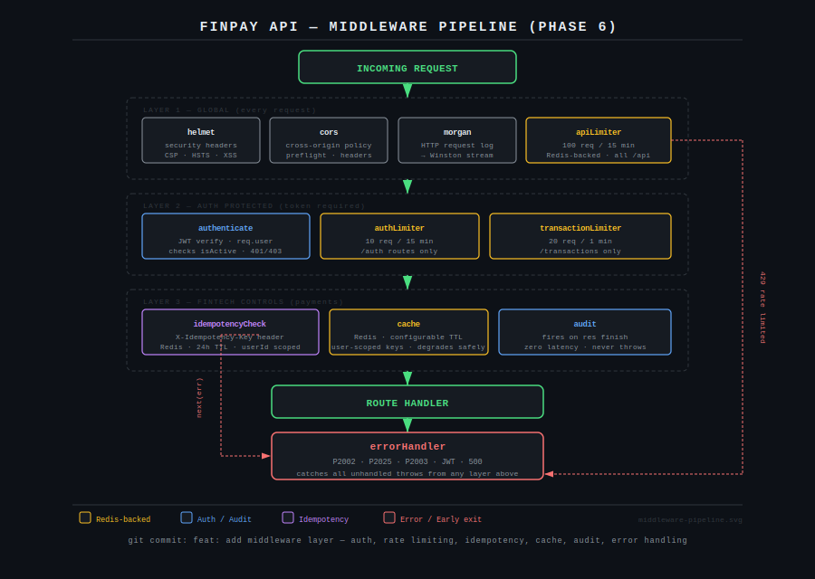
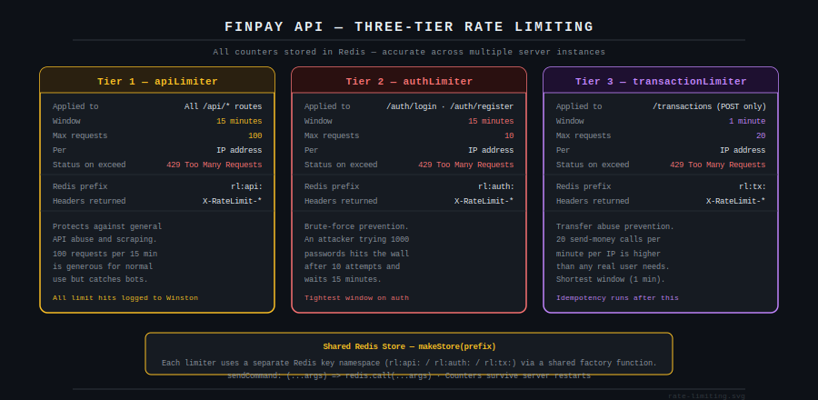

# FinPay API — Phase 6: Middleware Layer

Six middleware files. Every HTTP request passes through them in a fixed order before it reaches a route handler. This chapter explains what each one does, why it exists, and the design decisions behind it.

---

## Middleware Pipeline



The pipeline is built in three layers. Layer one applies to every request regardless of route. Layer two activates only on authenticated routes and applies progressively tighter rate limits depending on what the route does. Layer three handles the fintech-specific concerns: idempotency, caching, and audit logging. The error handler sits at the bottom as a catch-all — any unhandled throw from any layer above lands here.

The build order matters. `errorHandler` is written first because every other file you write needs a safety net to throw into. Without it, a bug in any middleware crashes the process with an unhandled rejection rather than returning a clean error response.

---

## Step 6.1 — Error Handler

`src/middleware/errorHandler.js`

The global error handler has four responsibilities in one place: Prisma error code mapping, JWT error mapping, generic status code passthrough, and ensuring 500 errors never leak internal details to the client.

**Prisma error mapping**

Prisma throws errors with machine-readable codes rather than HTTP status codes. Without mapping, a duplicate email registration returns a 500 with a raw Prisma stack trace. With mapping, it returns a 409 with a clean message:

| Prisma code | Meaning | HTTP status |
|---|---|---|
| P2002 | Unique constraint violation | 409 Conflict |
| P2025 | Record not found | 404 Not Found |
| P2003 | Foreign key constraint | 400 Bad Request |

**500 errors never leak**

The handler checks `statusCode`. If it is 500, the message returned to the client is always `"Internal server error"` — never the actual error message. The actual message is logged internally through Winston. This is the correct production behaviour: clients get enough to know something went wrong, engineers get enough to fix it.

**Test:**

```bash
node -e "
  const errorHandler = require('./src/middleware/errorHandler');
  const mockReq = { method: 'GET', originalUrl: '/test', ip: '127.0.0.1', user: null };
  const mockRes = { status: (code) => ({ json: (body) => console.log('Status:', code, body.message) }) };

  errorHandler(new Error('Something broke'), mockReq, mockRes, null);

  const authErr = new Error('Unauthorized'); authErr.statusCode = 401;
  errorHandler(authErr, mockReq, mockRes, null);

  const prismaErr = new Error('Unique'); prismaErr.code = 'P2002'; prismaErr.meta = { target: ['email'] };
  errorHandler(prismaErr, mockReq, mockRes, null);
"
```

Expected: status 500, 401, 409 in sequence.

---

## Step 6.2 — Auth Middleware

`src/middleware/auth.js`

JWT verification with a database lookup on every request. Two distinct rejection cases are handled separately: a missing or expired token returns 401, but a valid token belonging to a deactivated account returns 403. The distinction matters — 401 means "authenticate again", 403 means "you are authenticated but not permitted".

The decoded token carries only the `userId`. The full user object is fetched from the database and attached to `req.user` so every downstream handler has access to the authenticated user without making its own database call.

```javascript
req.user = {
  id, email, firstName, lastName, isActive
}
```

JWT errors (`JsonWebTokenError`, `TokenExpiredError`) are forwarded to `next(err)` rather than handled here. They are mapped to 401 responses by the error handler. This keeps the auth middleware focused on a single concern.

---

## Step 6.3 — Rate Limiting

`src/middleware/rateLimiter.js`



Three limiters, one shared Redis store factory. Each limiter uses a separate key namespace in Redis so they operate independently.

The factory pattern avoids repeating the Redis store configuration:

```javascript
const makeStore = (prefix) => new RedisStore({
  sendCommand: (...args) => redis.call(...args),
  prefix: `rl:${prefix}:`,
});
```

**Why three tiers rather than one?**

A single global limiter with a limit generous enough for normal use provides almost no protection on sensitive endpoints. An attacker trying to brute-force login passwords would exhaust maybe 10 of their 100 requests per 15 minutes on auth. The three-tier design applies the tightest limits exactly where they are needed:

The auth limiter at 10 requests per 15 minutes means a brute-force attempt against a single account can try at most 10 passwords before being locked out for 15 minutes. Attempting 1,000 common passwords at that rate takes over 25 hours — long enough to make automated attacks impractical.

The transaction limiter at 20 requests per minute uses a shorter window because transfer abuse tends to be rapid rather than sustained. An automated script attempting to drain an account would hit the wall within seconds.

All limit violations are logged to Winston with the IP address, endpoint, and remaining window time. This creates an observable abuse signal even when the attack is rate-limited successfully.

---

## Step 6.4 — Idempotency

`src/middleware/idempotency.js`

Duplicate payment prevention using the `X-Idempotency-Key` request header. This is the pattern Stripe uses and is the most fintech-specific feature in the project.

**The problem it solves:** A client sends a POST to `/transactions/send`. The network drops the response. The client does not know if the transaction succeeded. It retries. Without idempotency, money is moved twice. With idempotency, the second request returns the original response and no second transaction is created.

**How it works:**

1. Client sends `X-Idempotency-Key: <uuid>` with every payment request
2. Middleware checks Redis for that key, namespaced by `userId` to prevent spoofing
3. Key found → return the cached response immediately, skip the handler
4. Key not found → allow the request through, intercept the successful response, store it in Redis with a 24-hour TTL

Keys are scoped per user: `idempotency:{userId}:{key}`. This prevents one user from using another user's idempotency key to replay their transactions.

Only successful (2xx) responses are cached. If a request fails with a 400 or 500, the key is not stored — the client can retry with the same key and get a fresh attempt.

---

## Step 6.5 — Cache Middleware

`src/middleware/cache.js`

Redis response cache with a configurable TTL applied per route. Cache keys are scoped by URL and `userId` — user A never receives user B's cached balance.

```javascript
router.get('/accounts', authenticate, cache(30), handler)
//                                         ↑
//                                    TTL in seconds
```

The implementation intercepts `res.json` after a cache miss to store the response without blocking the handler:

```javascript
res.json = async (body) => {
  if (res.statusCode === 200) {
    await redis.setex(key, ttlSeconds, JSON.stringify(body));
  }
  return originalJson(body);
};
```

If Redis is unavailable, the middleware calls `next()` and the request is served normally without caching. This graceful degradation means a Redis outage does not take down the API — it only removes the cache layer temporarily.

---

## Step 6.6 — Audit Logger

`src/middleware/auditLogger.js`

Append-only audit trail for every state-changing action. The key design decision: it runs after the response is sent, not before.

```javascript
res.on('finish', async () => {
  if (res.statusCode >= 400) return; // only audit successful operations
  await prisma.auditLog.create({ ... });
});
next(); // continues immediately — response is not held
```

Because the write happens in the `finish` event, the audit log adds zero latency to the request. The response is already sent to the client before the database write begins.

Failures in the audit write are caught and logged internally through Winston. They are never thrown. A bug in the audit layer must not roll back or block the user's actual transaction — the audit is a side effect, not part of the critical path.

Usage on a route:

```javascript
router.post('/send', authenticate, audit('SEND_MONEY', 'transaction'), handler)
```

---

## Commit 6

```bash
git add src/middleware/
git commit -m "feat: add middleware layer — auth, rate limiting, idempotency, cache, audit, error handling

auth.js:
- JWT verification, req.user attachment, 401 vs 403 distinction

rateLimiter.js:
- apiLimiter: 100 req/15min (global)
- authLimiter: 10 req/15min (brute force prevention)
- transactionLimiter: 20 req/min (transfer abuse)
- All backed by Redis, all violations logged

idempotency.js:
- X-Idempotency-Key header, 24h TTL, userId-scoped keys
- Only caches 2xx responses

cache.js:
- Configurable TTL per route, user-scoped keys
- Degrades gracefully if Redis is unavailable

auditLogger.js:
- Fires on res finish — zero latency impact
- Failures logged internally, never thrown

errorHandler.js:
- Prisma codes: P2002, P2025, P2003
- JWT: JsonWebTokenError, TokenExpiredError
- 500s never leak internal details"
```

---

## Verification

```bash
node -e "
  require('dotenv').config();

  const checks = [
    ['errorHandler',       () => typeof require('./src/middleware/errorHandler') === 'function'],
    ['authenticate',       () => typeof require('./src/middleware/auth').authenticate === 'function'],
    ['apiLimiter',         () => typeof require('./src/middleware/rateLimiter').apiLimiter === 'function'],
    ['authLimiter',        () => typeof require('./src/middleware/rateLimiter').authLimiter === 'function'],
    ['transactionLimiter', () => typeof require('./src/middleware/rateLimiter').transactionLimiter === 'function'],
    ['idempotencyCheck',   () => typeof require('./src/middleware/idempotency').idempotencyCheck === 'function'],
    ['cache',              () => typeof require('./src/middleware/cache').cache === 'function'],
    ['audit',              () => typeof require('./src/middleware/auditLogger').audit === 'function'],
  ];

  for (const [name, check] of checks) {
    try { console.log(check() ? 'OK  ' + name : 'FAIL ' + name); }
    catch (err) { console.log('ERR  ' + name + ' — ' + err.message); }
  }

  setTimeout(() => process.exit(0), 300);
"
```

Expected: `OK` for all eight middleware exports.

---

## Git Log After Phase 6

```
feat: add middleware layer — auth, rate limiting, idempotency, cache, audit, error handling
feat: add utility layer — response formatter and async handler
feat: add configuration layer — logger, Redis, database
fix: add all models to prisma schema
fix: add url = env(DATABASE_URL) to prisma datasource block
fix: downgrade to Prisma 5 — Prisma 6 incompatible with .env workflow
fix: explicitly load .env for Prisma CLI
fix: remove auto-generated prisma.config.ts — JS project not TS
fix: use npx prefix for prisma scripts — CLI not in global PATH
fix: change postgres port to 5433 to avoid conflict with system PostgreSQL
chore: add Docker infrastructure and database schema
chore: install dependencies and initialise Prisma
chore: initialise project scaffold
```

---

## What Comes Next — Phase 7

Three service files — this is where the business logic lives:

| File | Responsibility |
|---|---|
| `auth.service.js` | Register, login, JWT generation |
| `account.service.js` | Balance lookup, account details |
| `transaction.service.js` | Atomic money transfer, transaction history |

The transaction service is the most important file in the project. It uses Prisma's `$transaction()` block to guarantee that the sender debit and receiver credit are always atomic. If the credit fails after the debit succeeds, both operations roll back. No state exists where money leaves one account without arriving in another.
