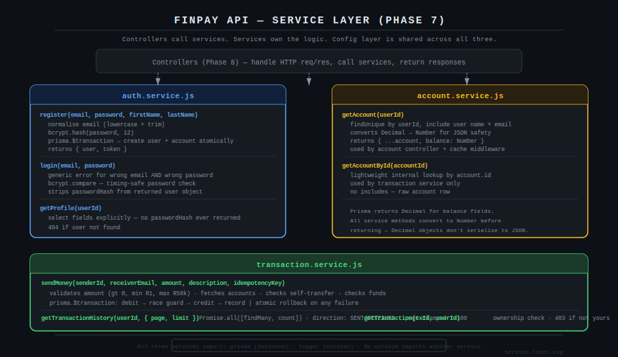
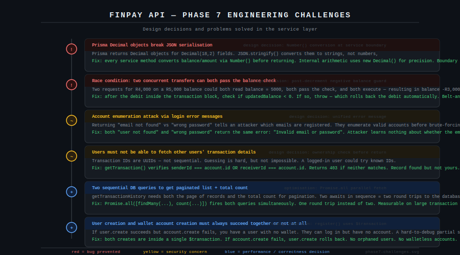
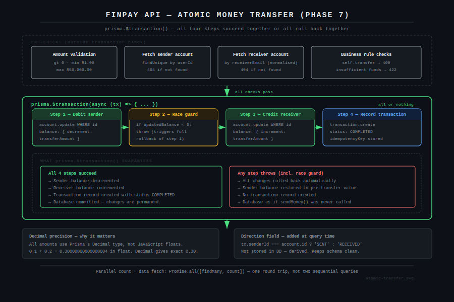

# FinPay API — Phase 7: Service Layer

Three service files. This is the most important phase in the project. Everything built before this point — Docker, config, middleware — exists to support what happens in these files. Controllers handle HTTP. Services own the logic. If Express were replaced tomorrow, the business rules in this layer would not change.

---

## Service Architecture



Each service imports only from the config layer (`prisma`, `logger`). No service imports another service. Controllers, written in Phase 8, are the only callers. This boundary keeps the business logic testable and framework-independent.

---

## Engineering Challenges



Six specific decisions made in this phase — three bugs prevented, one security issue addressed, and two correctness and performance choices.

### Prisma Decimal objects break JSON serialisation

Prisma returns `Decimal` objects for `Decimal(18,2)` columns, not JavaScript numbers. Passing them directly to `res.json()` serialises them as strings — `"4500.00"` instead of `4500`. Every client would need to parse the string. Worse, the inconsistency is invisible in development unless you inspect the raw response.

The fix is a clear rule: all arithmetic inside a service method uses `new Decimal()` for precision. All values returned from a service method call `Number()` on any balance or amount field. The conversion happens at the service boundary and nowhere else.

```javascript
return {
  ...account,
  balance: Number(account.balance),  // Decimal → number at the boundary
};
```

### Race condition on concurrent transfers

The balance pre-check happens before the transaction block:

```javascript
if (new Decimal(senderAccount.balance).lt(transferAmount)) {
  throw new Error('Insufficient funds');
}
```

This check is correct but not sufficient on its own. Two simultaneous requests for R4,000 on a R5,000 balance can both read the balance as 5,000, both pass the check, and both execute — resulting in a final balance of -R3,000.

The fix is a post-decrement guard inside the transaction block:

```javascript
const updatedSender = await tx.account.update({
  where: { id: senderAccount.id },
  data: { balance: { decrement: transferAmount } },
});

if (new Decimal(updatedSender.balance).lt(0)) {
  throw new Error('Insufficient funds after concurrent check');
  // this throw triggers full rollback — step 1 is reversed automatically
}
```

The throw inside `$transaction` causes Prisma to roll back every operation that ran before it in that block. The debit is reversed. The balance is never negative.

### Account enumeration via login error messages

Returning different errors for "email not found" vs "wrong password" gives an attacker a way to enumerate which email addresses are registered. They send login requests for a list of emails and note which ones return "email not found" vs "wrong password". They now have a validated list of active accounts to attack.

```javascript
// Bad — leaks whether the email exists
if (!user) throw new Error('Email not found');
if (!passwordMatch) throw new Error('Wrong password');

// Correct — attacker learns nothing
const invalidCredentialsError = () => {
  const err = new Error('Invalid email or password');
  err.statusCode = 401;
  return err;
};

if (!user) throw invalidCredentialsError();
if (!passwordMatch) throw invalidCredentialsError();
```

Both failure cases return the same message, same status code, and take the same code path.

### Transaction ownership enforcement

Transaction IDs are UUIDs — not sequential integers. Guessing one is hard but not impossible, and a compromised session token could be used to probe for known IDs. `getTransaction()` does not rely on obscurity. It explicitly checks that the requesting user is either the sender or the receiver before returning:

```javascript
const belongsToUser =
  transaction.senderId === account.id ||
  transaction.receiverId === account.id;

if (!belongsToUser) {
  const err = new Error('Access denied');
  err.statusCode = 403;
  throw err;
}
```

The transaction is found — it exists — but the user does not own it. 403 is returned, not 404. Returning 404 here would allow an attacker to infer whether a transaction ID is valid.

### Parallel count and data fetch

Paginated endpoints need both the page of records and the total count for the `totalPages` and `hasNext` fields. The naive implementation awaits them in sequence — two round trips to the database.

```javascript
// Two sequential queries — avoidable
const transactions = await prisma.transaction.findMany({ ... });
const total = await prisma.transaction.count({ ... });

// One round trip — both run in parallel
const [transactions, total] = await Promise.all([
  prisma.transaction.findMany({ ... }),
  prisma.transaction.count({ ... }),
]);
```

On a table with thousands of transactions, the count query runs on the same indexed columns as the data query. Running them in parallel halves the waiting time on this endpoint.

### Atomic user + wallet account creation

Registration creates two rows: a `users` row and an `accounts` row. If they were created in separate operations and the second failed, you would have a user who can authenticate but has no wallet. That state is hard to detect and hard to recover from.

Both creates run inside a single `$transaction`. If `account.create` fails, `user.create` is rolled back. The database either has both rows or neither.

---

## Atomic Transfer Flow



The transfer function is the most important piece of code in the project. Four steps, all inside one `$transaction` block. Any failure at any step — including the post-decrement race guard — rolls back all prior steps automatically. The database returns to its exact state before `sendMoney()` was called.

**Transfer limits enforced before the transaction block:**

| Check | Limit | Error |
|---|---|---|
| Minimum amount | R1.00 | 400 |
| Maximum amount | R50,000.00 | 400 |
| Insufficient funds | balance < amount | 422 |
| Self-transfer | sender === receiver | 400 |

422 Unprocessable Entity is used for insufficient funds rather than 400 Bad Request. The request is well-formed — it is a business rule violation, not a malformed request.

---

## Step 7.1 — Auth Service

`src/services/auth.service.js`

```bash
node -e "
  require('dotenv').config();
  const authService = require('./src/services/auth.service');

  async function test() {
    const result = await authService.register({
      email: 'test@finpay.dev', password: 'SecurePass123',
      firstName: 'Test', lastName: 'User',
    });
    console.log('register OK:', result.user.email);
    console.log('token generated:', result.token.length > 20);

    const login = await authService.login({ email: 'test@finpay.dev', password: 'SecurePass123' });
    console.log('login OK — passwordHash excluded:', !login.user.passwordHash);

    try {
      await authService.login({ email: 'test@finpay.dev', password: 'wrong' });
    } catch (err) {
      console.log('wrong password rejected:', err.message);
    }

    const { PrismaClient } = require('@prisma/client');
    const p = new PrismaClient();
    await p.account.deleteMany({ where: { user: { email: 'test@finpay.dev' } } });
    await p.user.deleteMany({ where: { email: 'test@finpay.dev' } });
    await p.\$disconnect();
    console.log('cleanup done');
  }
  test().catch(console.error);
"
```

---

## Step 7.2 — Account Service

`src/services/account.service.js`

Exports `getAccount(userId)` for the account controller and `getAccountById(accountId)` for internal use by the transaction service. The distinction matters: the controller version includes the user's name and email for display. The internal version is a lightweight raw account row used only for balance checks.

---

## Step 7.3 — Transaction Service

`src/services/transaction.service.js`

Run the full transfer test to verify atomicity:

```bash
node -e "
  require('dotenv').config();
  async function test() {
    const { PrismaClient } = require('@prisma/client');
    const bcrypt = require('bcryptjs');
    const prisma = new PrismaClient();
    const hash = await bcrypt.hash('password', 10);

    const alice = await prisma.user.create({
      data: { email: 'alice.tx@finpay.dev', passwordHash: hash, firstName: 'Alice', lastName: 'Test',
        account: { create: { balance: 5000.00, currency: 'ZAR' } } },
      include: { account: true },
    });
    const bob = await prisma.user.create({
      data: { email: 'bob.tx@finpay.dev', passwordHash: hash, firstName: 'Bob', lastName: 'Test',
        account: { create: { balance: 1000.00, currency: 'ZAR' } } },
      include: { account: true },
    });

    const txService = require('./src/services/transaction.service');
    const tx = await txService.sendMoney({
      senderId: alice.id, receiverEmail: 'bob.tx@finpay.dev', amount: 500, description: 'test',
    });
    console.log('transfer OK — status:', tx.status, 'amount:', tx.amount);

    const aliceAfter = await prisma.account.findUnique({ where: { userId: alice.id } });
    const bobAfter = await prisma.account.findUnique({ where: { userId: bob.id } });
    console.log('Alice:', Number(aliceAfter.balance), '(expected 4500)');
    console.log('Bob:  ', Number(bobAfter.balance), '(expected 1500)');

    try { await txService.sendMoney({ senderId: alice.id, receiverEmail: 'bob.tx@finpay.dev', amount: 999999 }); }
    catch (err) { console.log('insufficient funds blocked:', err.statusCode); }

    await prisma.transaction.deleteMany({ where: { OR: [{ sender: { userId: alice.id } }, { receiver: { userId: bob.id } }] } });
    await prisma.account.deleteMany({ where: { userId: { in: [alice.id, bob.id] } } });
    await prisma.user.deleteMany({ where: { id: { in: [alice.id, bob.id] } } });
    await prisma.\$disconnect();
    console.log('cleanup done');
  }
  test().catch(console.error);
"
```

---

## Commit 7

```bash
git add src/services/
git commit -m "feat: add service layer — auth, account, transaction

auth.service.js:
- register(): user + account created atomically in one $transaction
- login(): unified error prevents account enumeration
- Email normalised on register and login
- bcrypt cost factor 12

account.service.js:
- Decimal -> Number conversion at service boundary
- getAccountById() lightweight internal variant

transaction.service.js:
- sendMoney(): atomic transfer via prisma.$transaction()
  - Pre-check + post-decrement race condition guard
  - Limits: min R1, max R50k, no self-transfer
- getTransactionHistory(): parallel count + data fetch
  - Page size clamped 1-100
  - Direction field: SENT/RECEIVED derived at query time
- getTransaction(): 403 on ownership failure (not 404)"
```

---

## Git Log After Phase 7

```
feat: add service layer — auth, account, transaction
feat: add middleware layer — auth, rate limiting, idempotency, cache, audit, error handling
feat: add utility layer — response formatter and async handler
feat: add configuration layer — logger, Redis, database
fix: add all models to prisma schema
fix: add url = env(DATABASE_URL) to prisma datasource block
fix: downgrade to Prisma 5 — Prisma 6 incompatible with .env workflow
fix: explicitly load .env for Prisma CLI
fix: remove auto-generated prisma.config.ts — JS project not TS
fix: use npx prefix for prisma scripts — CLI not in global PATH
fix: change postgres port to 5433 to avoid conflict with system PostgreSQL
chore: add Docker infrastructure and database schema
chore: install dependencies and initialise Prisma
chore: initialise project scaffold
```

---

## What Comes Next — Phase 8

Phase 8 wires everything together. Controllers call services and return HTTP responses. Routes map URLs to controllers and apply the correct middleware chain. `app.js` registers routes, global middleware, and Swagger. `server.js` starts the server and handles graceful shutdown.

After Phase 8 the server runs and every endpoint is live.
