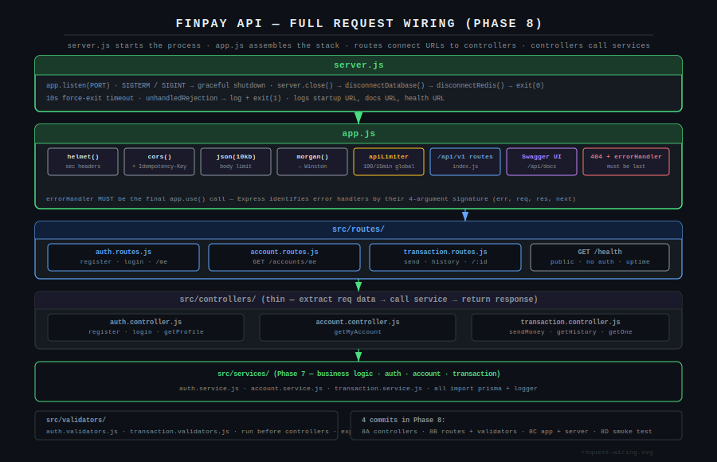
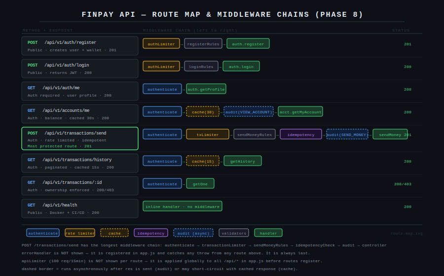
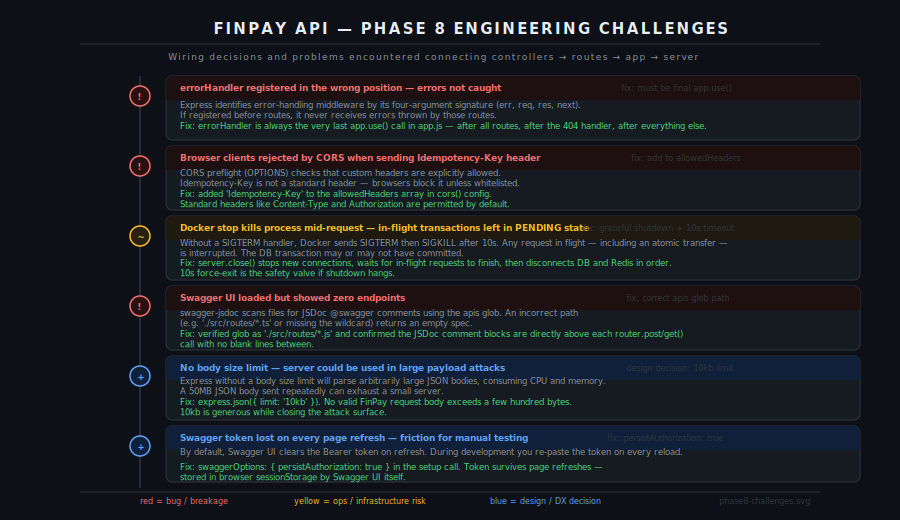

# FinPay API — Phase 8: Wiring Everything Together

Controllers, routes, app assembly, and server startup. After this phase the API is live. Every endpoint responds, Swagger is accessible, and the server shuts down cleanly when Docker stops it.

Phase 8 produces four commits rather than one — each commit is a distinct, testable unit of work.

---

## Request Wiring



Four layers connect in a strict order. `server.js` starts the process and manages lifecycle. `app.js` assembles the global middleware stack and mounts the route index. Routes map URLs to controller functions and apply the correct per-route middleware chain. Controllers extract data from the request, delegate to a service, and return a formatted response. Services, built in Phase 7, never touch `req` or `res`.

---

## Route Map



Eight endpoints. Every route shows its full middleware chain left to right in execution order. `POST /transactions/send` has the longest chain: authenticate → transactionLimiter → sendMoneyRules → idempotencyCheck → audit → controller. The `apiLimiter` and `errorHandler` are not shown per-route because they apply globally in `app.js` — above and below every route respectively.

---

## Engineering Challenges



Six wiring problems — two hard bugs, one operational risk, one Swagger configuration issue, and two design decisions that close attack surfaces.

### errorHandler registered in the wrong position

Express identifies error-handling middleware by its four-argument signature: `(err, req, res, next)`. If `errorHandler` is registered before routes, Express treats it as regular middleware — not an error handler — and errors thrown by routes fall through to Express's default handler, which returns an HTML error page.

The rule is absolute: `errorHandler` must be the very last `app.use()` call in `app.js`. After all routes. After the 404 handler. After everything.

```javascript
// app.js — order is load-bearing
app.use('/api/v1', routes);           // routes first
app.use('*', notFoundHandler);        // 404 second
app.use(errorHandler);                // error handler always last
```

### CORS blocking the Idempotency-Key header

Browsers send a CORS preflight (OPTIONS) request before any cross-origin request that carries a custom header. CORS only permits custom headers that are explicitly listed in `allowedHeaders`. `Idempotency-Key` is not a standard header — it is not permitted by default.

Without this fix, any browser client sending the header receives a CORS error before the request reaches Express. The server never sees the request at all.

```javascript
app.use(cors({
  allowedHeaders: ['Content-Type', 'Authorization', 'Idempotency-Key'],
}));
```

`Content-Type` and `Authorization` would be permitted anyway by the CORS spec. Adding `Idempotency-Key` explicitly is what unblocks browser clients.

### Graceful shutdown — in-flight transfers left in PENDING state

Without a SIGTERM handler, Docker sends SIGTERM when stopping a container, waits 10 seconds, then sends SIGKILL. A transfer in progress — inside `prisma.$transaction()` — is interrupted mid-execution. Whether the database transaction committed or not depends on exactly which instruction was executing when the process died. The result is unpredictable.

The shutdown sequence in `server.js` closes this gap:

```
SIGTERM received
  → server.close()          stop accepting new connections
  → wait for in-flight requests to finish
  → disconnectDatabase()    close Prisma connection pool
  → disconnectRedis()       flush and close Redis client
  → process.exit(0)
```

A 10-second force-exit runs in parallel. If the graceful shutdown hangs — because a request is stuck — the force-exit prevents the container from blocking a deployment indefinitely.

### Swagger UI showing zero endpoints

`swagger-jsdoc` scans source files for `@swagger` JSDoc blocks using a glob pattern. The `apis` field in the Swagger options must point to the correct files. An incorrect glob returns an empty OpenAPI spec and Swagger UI shows nothing.

Two things to verify if Swagger renders no endpoints:

1. The `apis` glob resolves to the correct files: `'./src/routes/*.js'`
2. The `@swagger` JSDoc comment block is directly above the `router.post()` or `router.get()` call with no blank lines separating the comment from the route declaration

### Body size limit — large payload attack surface

Express without a body size limit will parse JSON bodies of any size. A script sending repeated 50MB payloads can exhaust a server's memory and CPU with no rate limiting or validation catching it early.

```javascript
app.use(express.json({ limit: '10kb' }));
```

No valid FinPay API request body exceeds a few hundred bytes. The largest is a register request with four string fields. 10kb is generous and still closes the attack surface entirely.

### Swagger token lost on page refresh

By default Swagger UI clears the Bearer token when the page is refreshed. During manual testing this means pasting the token on every reload. `persistAuthorization: true` stores the token in the browser's `sessionStorage` — it survives refreshes for the duration of the browser session.

```javascript
swaggerUi.setup(swaggerSpec, {
  swaggerOptions: { persistAuthorization: true },
})
```

---

## Step 8.1–8.3 — Controllers

Three thin files. Controllers have exactly one job: extract data from `req`, call the service, call the response formatter. No `if` statements beyond the validation check. No database calls. No business logic.

```javascript
// auth.controller.js — register
const register = asyncHandler(async (req, res) => {
  const errors = validationResult(req);
  if (!errors.isEmpty()) return error(res, 'Validation failed', 400, errors.array());

  const { email, password, firstName, lastName } = req.body;
  const result = await authService.register({ email, password, firstName, lastName });
  return success(res, result, 'Account created successfully', 201);
});
```

The `asyncHandler` wrapper from Phase 5 means there is no `try/catch` — any thrown error is automatically forwarded to `errorHandler`.

**Commit 8A:**

```bash
git add src/controllers/
git commit -m "feat: add controllers — auth, account, transaction

Thin controllers: extract req data, delegate to services, format responses.
Validation errors handled before service calls via validationResult().
paginated() helper used for transaction history."
```

---

## Step 8.4 — Validators

Input validation runs as route-level middleware before the controller is called. The service never receives invalid input.

**Auth validators — password requirements:**

```
min 8 characters · at least one uppercase · at least one number
```

These rules are enforced at the HTTP layer, not in the service. The service trusts that input arriving from the controller has already been validated.

**Transaction validators — amount range:**

```javascript
body('amount').isFloat({ min: 1.00, max: 50000.00 })
```

This duplicates the service-layer limit. The validator catches it at the HTTP boundary, returning a 400 with a field-level error message. The service guard is the enforcement layer that cannot be bypassed. Both are needed.

---

## Step 8.5–8.8 — Routes

Routes wire validators, middleware, and controllers together per endpoint. The order of arguments in each route declaration is the execution order.

**Most protected route:**

```javascript
router.post(
  '/send',
  authenticate,          // 1. JWT verification
  transactionLimiter,    // 2. 20 req/min cap
  sendMoneyRules,        // 3. input validation
  idempotencyCheck,      // 4. duplicate prevention
  audit('SEND_MONEY', 'transaction'),  // 5. audit log
  txController.sendMoney // 6. handler
);
```

The ordering is deliberate. Authentication runs first — an unauthenticated request fails immediately without touching Redis or the database. Rate limiting runs before validation so abusive traffic is shed before the server does any parsing work. Idempotency runs after validation so only structurally valid requests are checked against Redis. Audit fires after everything else and writes asynchronously on `res.finish`.

**Commit 8B:**

```bash
git add src/routes/ src/validators/
git commit -m "feat: add routes and input validators — auth, accounts, transactions

Routes:
- POST /api/v1/auth/register    (authLimiter + registerRules)
- POST /api/v1/auth/login       (authLimiter + loginRules)
- GET  /api/v1/auth/me          (authenticate)
- GET  /api/v1/accounts/me      (authenticate + cache 30s + audit)
- POST /api/v1/transactions/send (authenticate + txLimiter + rules + idempotency + audit)
- GET  /api/v1/transactions/history (authenticate + cache 15s)
- GET  /api/v1/transactions/:id  (authenticate)
- GET  /api/v1/health            (public)

Swagger JSDoc on all routes. Validators: email, password strength, amount range."
```

---

## Step 8.9–8.10 — App and Server

**Commit 8C:**

```bash
git add src/app.js src/server.js
git commit -m "feat: add app.js and server.js — server ready to run

app.js:
- helmet · cors (+ Idempotency-Key) · json(10kb) · morgan → Winston
- apiLimiter on all /api/ · Swagger at /api/docs · 404 handler · errorHandler last

server.js:
- Graceful shutdown: SIGTERM/SIGINT → close HTTP → DB → Redis → exit(0)
- 10s force-exit timeout
- unhandledRejection → log + exit(1)"
```

---

## Step 8.11 — Start the Server

```bash
npm run dev
```

Expected:

```
Redis connection established
Redis ready to accept commands
FinPay API started { port: 3000, environment: 'development', docs: '...', health: '...' }
```

---

## Step 8.12 — Smoke Test Every Endpoint

```bash
# Health
curl -s http://localhost:3000/api/v1/health | python3 -m json.tool

# Register
curl -s -X POST http://localhost:3000/api/v1/auth/register \
  -H "Content-Type: application/json" \
  -d '{"email":"alice@finpay.dev","password":"SecurePass123","firstName":"Alice","lastName":"Smith"}' \
  | python3 -m json.tool

# Login (copy the token)
curl -s -X POST http://localhost:3000/api/v1/auth/login \
  -H "Content-Type: application/json" \
  -d '{"email":"alice@finpay.dev","password":"SecurePass123"}' \
  | python3 -m json.tool

# Account balance (replace TOKEN)
curl -s http://localhost:3000/api/v1/accounts/me \
  -H "Authorization: Bearer TOKEN" | python3 -m json.tool

# Swagger UI
open http://localhost:3000/api/docs
```

Validation test — should return 400 with field errors:

```bash
curl -s -X POST http://localhost:3000/api/v1/auth/register \
  -H "Content-Type: application/json" \
  -d '{"email":"notanemail"}' | python3 -m json.tool
```

**Commit 8D:**

```bash
git add .
git commit -m "chore: phase 8 complete — server running and all endpoints verified

Smoke tested:
- GET  /api/v1/health             → 200
- POST /api/v1/auth/register      → 201 user + token
- POST /api/v1/auth/login         → 200 user + token
- GET  /api/v1/auth/me            → 200 profile
- GET  /api/v1/accounts/me        → 200 balance
- Swagger UI                      → /api/docs accessible
- Validation errors               → 400 with field-level messages
- Unknown routes                  → 404"
```

---

## Git Log After Phase 8

```
chore: phase 8 complete — server running and all endpoints verified
feat: add app.js and server.js — server ready to run
feat: add routes and input validators — auth, accounts, transactions
feat: add controllers — auth, account, transaction
feat: add service layer — auth, account, transaction
feat: add middleware layer — auth, rate limiting, idempotency, cache, audit, error handling
feat: add utility layer — response formatter and async handler
feat: add configuration layer — logger, Redis, database
fix: add all models to prisma schema
fix: add url = env(DATABASE_URL) to prisma datasource block
fix: downgrade to Prisma 5 — Prisma 6 incompatible with .env workflow
fix: explicitly load .env for Prisma CLI
fix: remove auto-generated prisma.config.ts — JS project not TS
fix: use npx prefix for prisma scripts — CLI not in global PATH
fix: change postgres port to 5433 to avoid conflict with system PostgreSQL
chore: add Docker infrastructure and database schema
chore: install dependencies and initialise Prisma
chore: initialise project scaffold
```

---

## What Comes Next

**Phase 9 — Seed data:**
Alice (R10,000), Bob (R5,000), Charlie (R2,500) with pre-existing transactions. The database looks like a live system, not an empty schema.

**Phase 10 — CI/CD pipeline:**
GitHub Actions workflow on every push: spin up PostgreSQL and Redis, run migrations, hit the health endpoint, build a Docker image, auto-deploy to Railway on merge to main.
