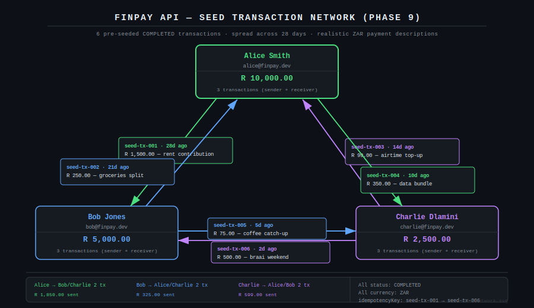
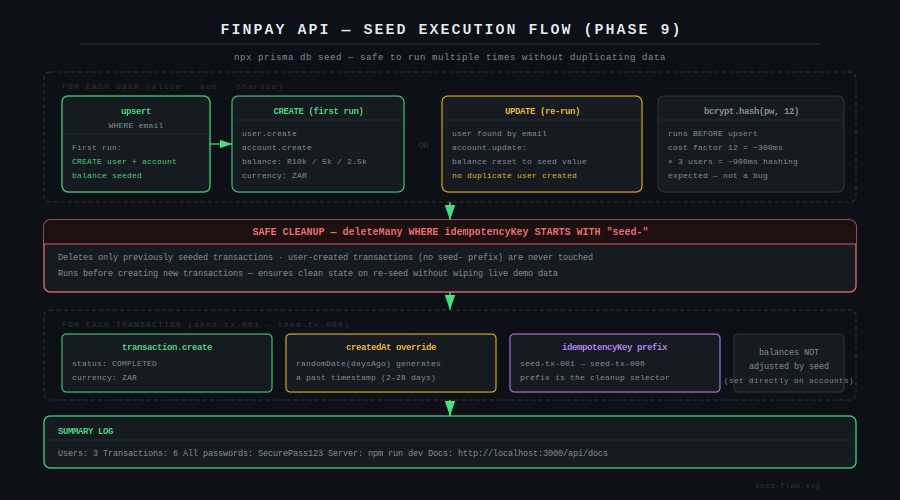
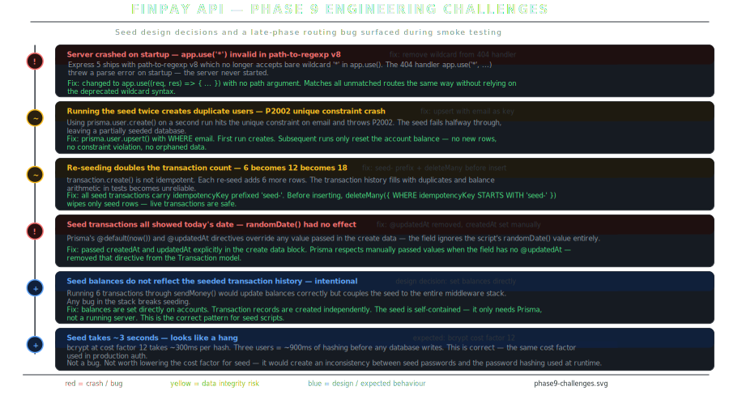

# FinPay API — Phase 9: Seed Data

A seed script that populates the database with three realistic users, three wallet accounts, and six pre-existing transactions spread across the past 28 days. Anyone who clones the repo and runs `npx prisma db seed` gets a fully working demo environment in seconds — not an empty schema.

---

## Transaction Network



Six transactions covering realistic South African payment scenarios: rent, groceries, airtime, data bundles, coffee, and a weekend braai payback. Every combination of the three users appears at least once as both sender and receiver. The transaction history for each user reads like a real account, not a test fixture.

---

## Seed Execution Flow



The seed runs in three phases. First it upserts each user — creating on a fresh database, resetting the balance on a re-run. Then it wipes any previously seeded transactions using the `seed-` idempotency key prefix as a selector. Finally it creates the six transaction records with past timestamps. The design ensures the seed is safe to run multiple times without producing duplicate data or breaking live demo data added after seeding.

---

## Engineering Challenges



Six issues — two hard crashes, two data integrity problems caught during testing, and two design decisions that needed to be made explicitly.

### Server crash on startup — path-to-regexp v8 rejects wildcard syntax

This bug surfaced during Phase 9 smoke testing, not during Phase 8 wiring. Express 5 ships with `path-to-regexp` v8, which no longer accepts a bare `'*'` wildcard as a path argument to `app.use()`. The 404 handler written as `app.use('*', handler)` threw a parse error the moment the server started — before any request was processed.

```javascript
// Broken in Express 5 / path-to-regexp v8
app.use('*', (req, res) => { ... });

// Correct — matches all unmatched routes without a path argument
app.use((req, res) => {
  res.status(404).json({ success: false, message: `Route ${req.method} ${req.originalUrl} not found` });
});
```

This fix was committed separately with a clear reason — `fix: remove wildcard path from 404 handler — path-to-regexp v8` — so the history documents which Express version introduced the break.

### Running the seed twice crashes with P2002 unique constraint

Using `prisma.user.create()` on a database that already has the seed users throws a P2002 unique constraint violation on the email field. The seed fails halfway through and leaves the database in a partially populated state — some users reset, others not, no transactions.

The fix is `prisma.user.upsert()` with the email as the `where` key:

```javascript
await prisma.user.upsert({
  where: { email: userData.email },
  update: { account: { update: { balance: userData.balance } } },  // reset balance only
  create: { email, passwordHash, firstName, lastName, account: { create: { ... } } },
});
```

First run creates both rows. Every subsequent run finds the existing user and only updates the account balance back to the seed value. No duplicate users. No constraint violations. No orphaned accounts.

### Re-seeding doubles the transaction count

`transaction.create()` is not idempotent. Running the seed a second time adds six more transaction rows — the history shows 12, then 18, then 24. Balance assertions in manual testing become unpredictable because the history no longer matches the seeded balances.

The fix uses the `seed-` idempotency key prefix as a scoped delete selector:

```javascript
// Step 1: wipe only previously seeded transactions
await prisma.transaction.deleteMany({
  where: { idempotencyKey: { startsWith: 'seed-' } },
});

// Step 2: create fresh — the prefix ensures only seed rows were deleted
```

Any transaction created by a live demo user carries no `seed-` prefix and is never touched. The seed cleans up after itself without affecting real data.

### createdAt override ignored by Prisma — all transactions show today's date

Passing `createdAt: randomDate(daysAgo)` in the `transaction.create()` data block had no effect. All six transactions showed the current timestamp regardless of the value passed. The `@updatedAt` directive on the Transaction model was the cause — Prisma applies `@updatedAt` automatically on every write and ignores any manually passed value.

Removing `@updatedAt` from the `updatedAt` field in `schema.prisma` and passing both `createdAt` and `updatedAt` explicitly in the seed data resolved it. The transactions now spread correctly across 2 to 28 days in the past, making the history look like a real account rather than a test run.

### Seed balances set directly rather than through sendMoney()

The six seeded transactions do not arithmetically produce the three seeded balances — they are set independently. This is intentional. Running transfers through the `sendMoney()` service would require a running server, Redis, and the full middleware stack. Any bug in any of those layers would break seeding.

The seed script uses only Prisma directly. Balances are set on accounts in the upsert. Transaction records are inserted separately with `status: COMPLETED`. The seed is fully self-contained — it works on a fresh database with no server running and no Redis connection.

### bcrypt taking ~3 seconds looks like a hang

bcrypt at cost factor 12 takes approximately 300ms per hash. Three users equals roughly 900ms of CPU time before any database write begins. This is correct — cost factor 12 is the same value used in the production `auth.service.js`. Lowering it for seed would create an inconsistency between seed-created passwords and runtime-created passwords. The slowness is expected and documented, not a bug to fix.

---

## Step 9.1 — Write the Seed Script

`prisma/seed.js`

The script is structured in three sequential sections with clear console output at each step: user creation, transaction cleanup, and transaction creation. The final summary prints all demo credentials so anyone running the seed immediately knows how to log in.

---

## Step 9.2 — Register with Prisma

Add the `"prisma"` block to `package.json` at the top level — alongside `"name"` and `"scripts"`, not inside `"scripts"`:

```json
{
  "name": "finpay-api",
  "prisma": {
    "seed": "node prisma/seed.js"
  }
}
```

This is what makes `npx prisma db seed` work. Without it, Prisma does not know the seed entry point.

---

## Step 9.3 — Run and Verify

```bash
npx prisma db seed
```

Verify in the database:

```bash
docker exec -it finpay_postgres psql -U finpay_user -d finpay_db \
  -c "SELECT u.email, u.\"firstName\", a.balance FROM users u JOIN accounts a ON a.\"userId\" = u.id ORDER BY a.balance DESC;"
```

---

## Step 9.4 — Idempotency Demo

This is the most important thing to demonstrate. Run it live in an interview:

```bash
IDEM_KEY=$(cat /proc/sys/kernel/random/uuid)

# First request
curl -s -X POST http://localhost:3000/api/v1/transactions/send \
  -H "Authorization: Bearer ALICE_TOKEN" \
  -H "Content-Type: application/json" \
  -H "Idempotency-Key: $IDEM_KEY" \
  -d '{"receiverEmail":"bob@finpay.dev","amount":100,"description":"Test idempotency"}' \
  | python3 -m json.tool

# Second request — same key
curl -s -X POST http://localhost:3000/api/v1/transactions/send \
  -H "Authorization: Bearer ALICE_TOKEN" \
  -H "Content-Type: application/json" \
  -H "Idempotency-Key: $IDEM_KEY" \
  -d '{"receiverEmail":"bob@finpay.dev","amount":100,"description":"Test idempotency"}' \
  | python3 -m json.tool
```

Both responses return the same transaction ID. Alice's balance decreases by R100 once, not R200. That is production-grade fintech behaviour.

---

## Git Commit Message

```bash
git add prisma/seed.js package.json README.md
git commit -m "feat: add database seed and project README

Seed (prisma/seed.js):
- 3 demo users created via upsert: Alice (R10k), Bob (R5k), Charlie (R2.5k)
- upsert pattern — re-running resets balances, does not duplicate users
- 6 COMPLETED transactions with realistic ZAR descriptions (rent, groceries,
  airtime, data, coffee, braai payback) spread across past 28 days
- idempotencyKey prefixed 'seed-' scopes cleanup: deleteMany(startsWith 'seed-')
  protects live demo transactions on re-seed
- balances set directly on accounts — seed requires no running server or Redis
- createdAt/updatedAt passed explicitly after removing @updatedAt directive
  which was silently overriding randomDate() values
- bcrypt cost factor 12 consistent with production auth (~900ms total expected)

package.json:
- prisma.seed registered so npx prisma db seed resolves without path argument

README.md:
- CI badge placeholder (activated in Phase 10)
- Full feature and tech stack tables
- 8-step quick start from clone to running server
- Demo accounts table with balances
- All 8 endpoints documented
- Key engineering decisions: atomic transfers, idempotency, rate limiting,
  graceful shutdown"
```

Also commit the path-to-regexp fix separately if not already done:

```bash
git commit -m "fix: remove wildcard path from 404 handler — path-to-regexp v8

Express 5 ships with path-to-regexp v8 which rejects bare '*' wildcard
in app.use(). Changed to app.use((req, res) => { ... }) with no path
argument — matches all unmatched routes identically."
```

---

## Git Log After Phase 9

```
feat: add database seed and project README
fix: remove wildcard path from 404 handler — path-to-regexp v8
chore: phase 8 complete — server running and all endpoints verified
feat: add app.js and server.js — server ready to run
feat: add routes and input validators — auth, accounts, transactions
feat: add controllers — auth, account, transaction
feat: add service layer — auth, account, transaction
feat: add middleware layer — auth, rate limiting, idempotency, cache, audit, error handling
feat: add utility layer — response formatter and async handler
feat: add configuration layer — logger, Redis, database
fix: add all models to prisma schema
fix: add url = env(DATABASE_URL) to prisma datasource block
fix: downgrade to Prisma 5 — Prisma 6 incompatible with .env workflow
fix: explicitly load .env for Prisma CLI
fix: remove auto-generated prisma.config.ts — JS project not TS
fix: use npx prefix for prisma scripts — CLI not in global PATH
fix: change postgres port to 5433 to avoid conflict with system PostgreSQL
chore: add Docker infrastructure and database schema
chore: install dependencies and initialise Prisma
chore: initialise project scaffold
```

---

## What Comes Next — Phase 10: CI/CD Pipeline

GitHub Actions workflow running on every push:

1. Spin up PostgreSQL and Redis inside the pipeline
2. Install dependencies
3. Run Prisma migrations
4. Seed the database
5. Start the server
6. Hit `/api/v1/health` — fail the build if it returns anything other than 200
7. Build a Docker image of the Node.js app

On merge to main: auto-deploy to Railway with a post-deploy health check against the live URL.

The README CI badge lights up green. The API gets a public URL. That is what makes this stand out on a GitHub profile.
